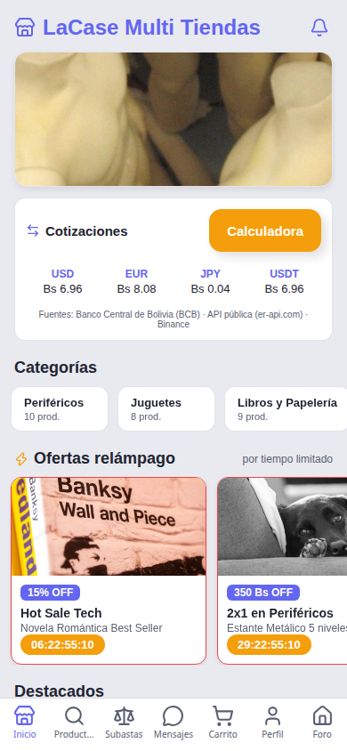
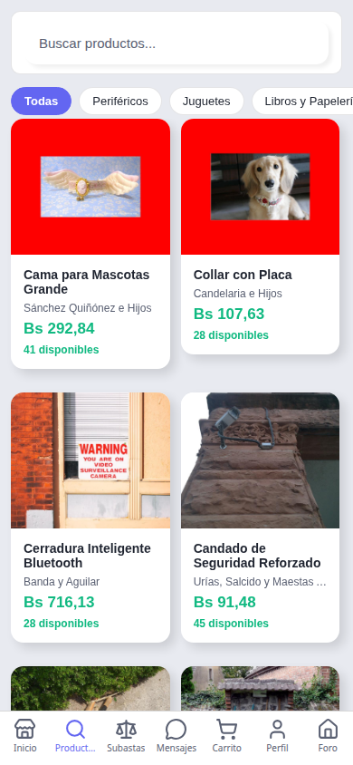
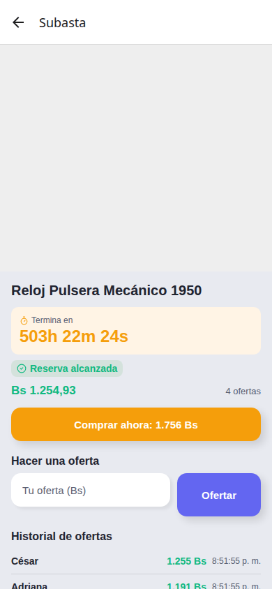
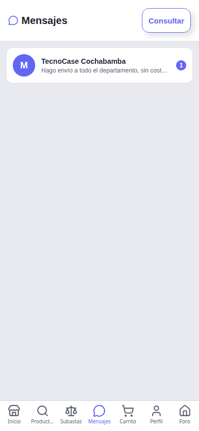
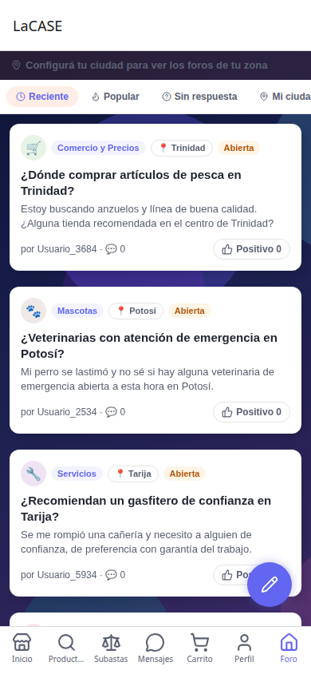
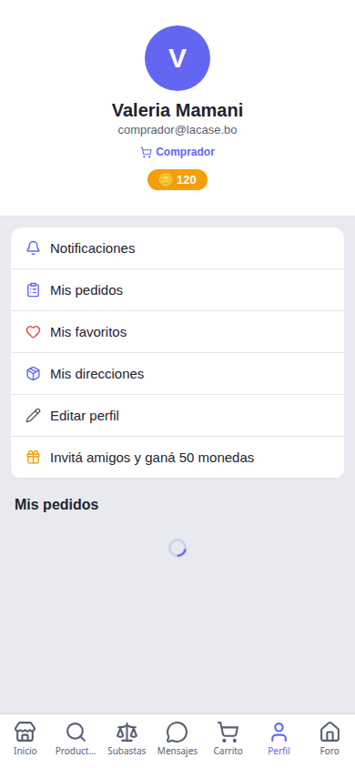
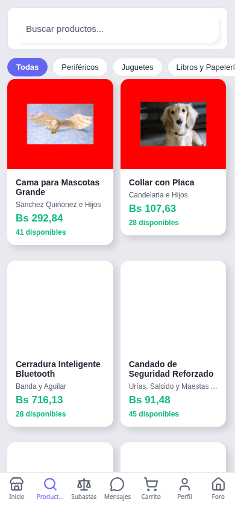

# LaCase — Marketplace Multi-Vendor

Marketplace multi-vendedor con catálogo unificado, comparación de precios entre tiendas,
cálculo de envío por ubicación, subastas estilo eBay, chat en tiempo real, sistema de comisiones
y panel de administración completo.

Esta entrega incluye el **backend** (API + base de datos) y la **app móvil Android**. El
frontend web se desarrolla en un repositorio aparte y se referencia aquí solo como demo
desplegada.

## Demo desplegada

| App | URL |
|---|---|
| Web | https://lacase-frontend.onrender.com |
| API | https://lacase-backend.onrender.com/api |
| Base de datos | PostgreSQL administrado en Supabase |
| App móvil (Android) | [`lacase.apk`](./lacase.apk) — ver [instalación](#app-móvil-apk) |

## Capturas de pantalla

| | | |
|---|---|---|
|  |  |  |
| **Inicio** — cotizaciones en vivo, categorías y ofertas relámpago | **Detalle de producto** — precio, vendedor y reseñas | **Subasta** — puja, reserva, historial de ofertas |
|  |  |  |
| **Mensajes** — chat comprador↔vendedor en tiempo real | **Foro** — preguntas y respuestas con contexto boliviano | **Perfil** — accesos según el rol del usuario |
|  | | |
| **Catálogo** — búsqueda y filtros multi-vendedor | | |

## Stack

| Capa | Tecnología |
|---|---|
| Backend | Node.js + Express + TypeScript + Prisma ORM |
| Base de datos | PostgreSQL (Supabase) |
| Frontend | React 19 + TypeScript + Vite + MUI 6 + Zustand + Recharts |
| App móvil | Expo (React Native) + TypeScript |
| Tiempo real | Socket.IO (chat, subastas, notificaciones) |
| Validación | Zod (backend y formularios) |
| Hosting | Render (API y sitio web) · Supabase (base de datos) |
| Calidad | ESLint + Prettier + Jest + GitHub Actions CI |

## Funcionalidades principales

La app móvil se organiza en 7 pestañas (**Inicio, Productos, Subastas, Mensajes, Carrito,
Perfil, Foro**) más un menú de **Perfil** que da acceso al resto de las pantallas según el rol
del usuario logueado.

### Inicio
- Cotizaciones de moneda en vivo (USD, EUR, JPY, USDT → Bs) con calculadora integrada
- Categorías destacadas y **ofertas relámpago** con descuento y cuenta regresiva

### Productos (catálogo)
- **Catálogo multi-vendedor**: productos de todas las tiendas con búsqueda global, filtros
  avanzados (categoría, departamento, tipo de entrega, permuta, marca, precio) e infinite scroll
- Detalle de producto con especificaciones, vendedor, reseñas y control de cantidad
- **Arma tu PC**: configurador de 8 slots con compatibilidad y calculadora

### Carrito y pedidos
- **Carrito agrupado por tienda** con merge de carrito guest tras login
- **Checkout atómico** con envío calculado por código postal y pago por **QR**
- Historial de pedidos (`Mis pedidos`) con detalle y seguimiento por orden
- **Mis favoritos** (wishlist) y **Mis direcciones** guardadas

### Subastas (estilo eBay)
- **Proxy bidding** (la oferta es un máximo), **precio de reserva**, **Buy It Now**,
  **anti-sniping** (extiende el tiempo), incremento dinámico por rango, watchlist
- La base de datos de demo incluye subastas activas con varias semanas de duración,
  algunas ya con ofertas

### Mensajes (chat)
- **Chat comprador↔vendedor** en tiempo real (Socket.IO) con badge de no leídos
- La cuenta de comprador de prueba ya tiene una conversación iniciada con la de vendedor
- **Notificaciones** por rol con campana global, historial persistente y navegación directa

### Perfil
- **Editar perfil**, ver monedas del juego (gamer coins) y estado de verificación
- **Invitá amigos y ganá monedas** (programa de referidos)
- Si el usuario es **vendedor**: `Mi tienda` (dashboard con gráficos de ventas), `Mis productos`
  (CRUD con **atributos dinámicos** EAV), `Carga masiva de productos`, `Equipo de tienda`
  (roles OWNER/ADMIN/EMPLOYEE), `Mis cupones`, `Mis promociones`, `Mis pagos` (comisión de
  plataforma configurable — %, mínimo, fijo, o sobre envío — con neto por orden) y `Editar tienda`
- Si el usuario es **administrador**: `Panel admin` (dashboard con gráficos), `Vendedores`,
  `Verificación de tiendas` y `Moderación del foro`

### Foro comunitario (LaCASE)
- Preguntas y respuestas por ciudad y categoría (precios, stock, empleos, alquileres,
  anticréticos, trámites, transporte, etc.), con contenido de ejemplo real de Bolivia
- Sistema de **karma** y rangos (Novato → Leyenda), votos, respuestas aceptadas y moderación
- Geolocalización por ciudad/departamento con subforos configurables

### Administración web (10 módulos, en el frontend)
Dashboard con gráficos Recharts · moderación de productos · gestión de vendedores y usuarios ·
categorías con editor de imágenes · banners con recorte · promociones con selector tienda→producto ·
reportes económicos · contenido del sitio · moneda (Bs base, USD con tasa actualizable)

## Arquitectura

```
LaCase/
  backend/
    src/
      config/      # env (validado con Zod), database, socket, cors
      controllers/ # Capa HTTP
      services/    # Lógica de negocio (comisiones, subastas, notificaciones...)
      middlewares/ # auth, roles, validación Zod, errores, rate limit, helmet
      routes/      # Definición de endpoints REST
      schemas/     # Schemas Zod de validación
      utils/       # errores, logger, paginación, envío, JWT
    prisma/        # Schema + seed
    tests/         # tests unitarios, de integración y E2E
  mobile/
    src/           # App Expo (React Native)
    android/       # Proyecto nativo Android (para generar el APK)
  screenshots/     # Capturas de pantalla usadas en este README
  .github/workflows/  # CI (lint + typecheck + test)
  render.yaml         # Blueprint de despliegue del backend en Render
  docker-compose.yml
  lacase.apk          # APK release, listo para instalar
```

El frontend web (React + Vite) vive en un repositorio separado, ya que no forma parte de
esta entrega; consume la misma API y se despliega también en Render.

## Despliegue en producción

- **Backend**: Render (Web Service) — Node.js + Prisma, conectado a Supabase mediante
  `DATABASE_URL`. Definido en [`render.yaml`](./render.yaml).
- **Base de datos**: proyecto PostgreSQL en Supabase, sincronizado con `npx prisma db push` y
  poblado con `prisma/seed.ts`.
- **App móvil**: el APK release incluido apunta directamente al backend desplegado en Render
  (sin necesidad de levantar nada localmente).
- **Web**: sitio estático en Render, compilado apuntando al mismo backend.

## Instalación y ejecución local

### 1. Base de datos

```bash
createdb pctienda
```

### 2. Backend

```bash
cd backend
cp .env.example .env    # Editar credenciales si es necesario
npm install
npx prisma db push       # Crear tablas
npx tsx prisma/seed.ts   # Poblar con datos de prueba
npm run dev              # API + WebSocket en :3000
```

### 3. App móvil

```bash
cd mobile
npm install
npm start                # Expo — escaneá el QR con Expo Go, o "a" para emulador Android
```

En desarrollo, la app apunta al backend local (`mobile/src/config/env.ts`); ajustá la IP de
tu PC ahí si probás desde un teléfono físico en la misma red.

### 4. (Opcional) Docker

```bash
docker compose up -d
```

## Credenciales de prueba

| Rol | Email | Password |
|---|---|---|
| Vendedor | vendedor@lacase.bo | password123 |
| Cliente | comprador@lacase.bo | password123 |

Además de estas dos cuentas fijas, el seed genera vendedores y compradores adicionales con
datos aleatorios (todos con contraseña `password123`) para poblar el catálogo, las subastas
y los chats de ejemplo.

## Comandos de calidad

```bash
# Backend (cd backend)
npm run lint          # ESLint
npm run typecheck     # tsc --noEmit
npm test              # Tests unitarios + integración + E2E
npm run test:coverage # Cobertura
npm run format        # Prettier

# Mobile (cd mobile)
npm test              # Jest
```

## App móvil (APK)

El archivo [`lacase.apk`](./lacase.apk), en la raíz del repositorio, es un **build Release**
firmado, listo para instalar en cualquier dispositivo Android sin pasar por ningún store. Ya
viene apuntando al backend desplegado en Render, así que funciona de forma independiente,
sin depender de que el proyecto esté corriendo en una PC local.

Para instalarlo:

1. Descargá `lacase.apk` al dispositivo Android.
2. Habilitá la instalación de "orígenes desconocidos" / "apps de fuentes externas" para el
   instalador que uses (Chrome, Archivos, etc.) cuando el sistema lo pida.
3. Abrí el APK descargado y confirmá la instalación.
4. Iniciá sesión con cualquiera de las credenciales de prueba de la tabla anterior.

Para regenerar el APK desde el código fuente:

```bash
cd mobile/android
./gradlew assembleRelease
# Resultado en mobile/android/app/build/outputs/apk/release/app-release.apk
```

## Endpoints principales

- API: `https://lacase-backend.onrender.com/api`
- Health: `GET /api/health`
- Productos: `GET /api/products` (filtros + cursor pagination)
- Subastas: `GET /api/auctions` / `POST /api/auctions/:id/bid`
- Chat: `GET /api/chat` / `POST /api/chat/:id/messages`
- Notificaciones: `GET /api/notifications`
- Reportes: `GET /api/admin/reports/sales`
- Moneda: `GET /api/currencies`
- Docs OpenAPI: `https://lacase-backend.onrender.com/api-docs`
